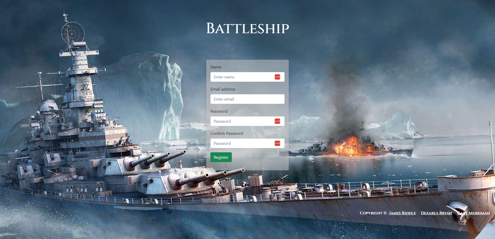
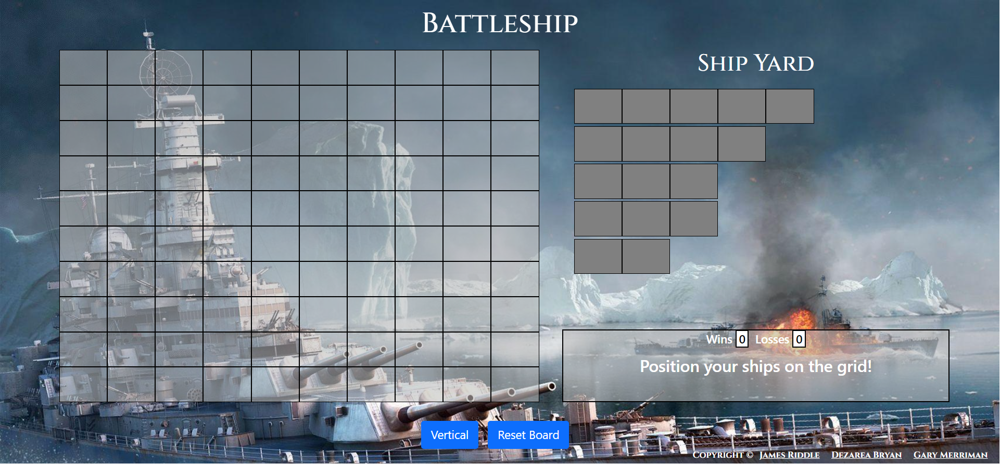
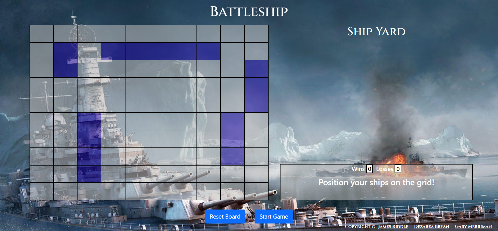
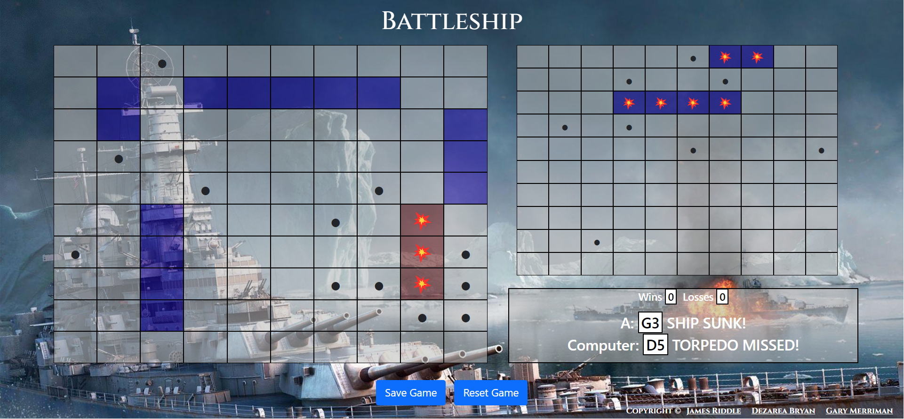
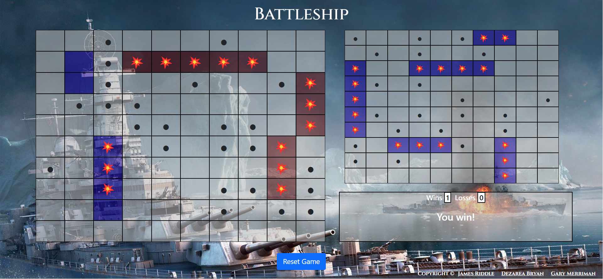
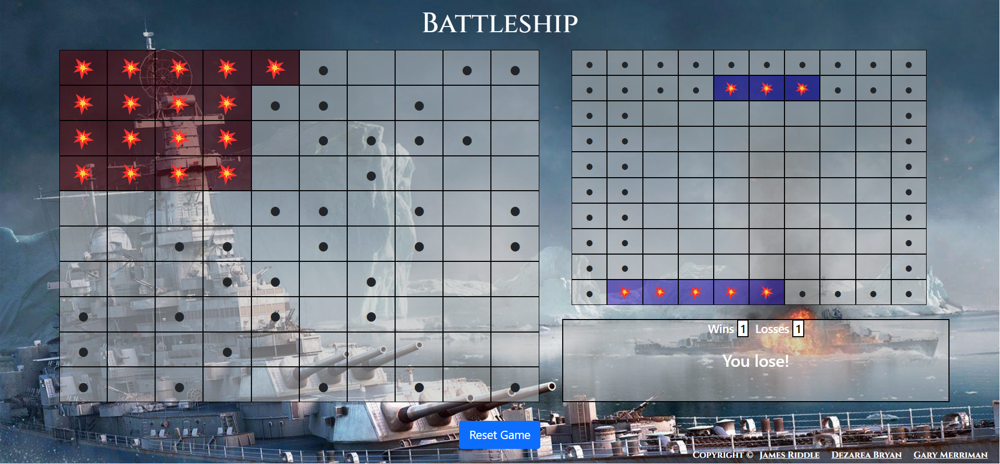

# Battleship


Battleship is a classic board game that has been recreated in the form of a web application. This application offers a user-friendly interface and allows users to engage in a fun and challenging gameplay experience. 

To access the game, users are required to register for an account or sign in with their existing account credentials. Once authenticated, the user can start a new game or load a previously saved one. The game starts with the user placing their ships on the board, and they can toggle the alignment of the ships to vertical or horizontal as needed.

Once the user has placed their ships, they can start playing against the AI opponent. The user can save their game at any point, allowing them to continue playing later or return to a previously saved game. The app tracks the user's game history, including their wins and losses, which are saved to their profile. 

The technology used in the development of this application includes React, Redux, and Axios on the client-side, along with Bootstrap for styling the UI. On the server-side, the app utilizes Node.js and Express for building the backend server, along with PostgreSQL for the database management. 

Overall, the Battleship web application offers a modern take on a classic game, providing an enjoyable and engaging experience for users of all ages.


## Live site

Check out the [Live Site](https://battleship-umber.vercel.app/login)! Our frontend is hosted on [Vercel](https://battleship-umber.vercel.app/login), and the backend is deployed using [Heroku](https://hidden-tundra-22870.herokuapp.com). Check out our demo of this app on [Youtube](https://www.youtube.com/embed/YZ7vUYK2cvs).


## Server Architecture

The server is built using the following technologies:

- Express.js
- PostgreSQL
- Sequelize ORM

The server architecture consists of the following main components:

- **Routes**: Handles incoming HTTP requests and delegates the corresponding request to the appropriate controller.
- **Controllers**: Contains the business logic for processing requests and returning responses.
- **Models**: Represents the database schema and provides an interface for interacting with the database.
- **Middleware**: Contains functions that are executed before or after a request is processed. Examples include authentication and error handling middleware.


## Tech Stack
The tech stack for this project includes a server-side application built with Node.js and Express.js, utilizing the Sequelize ORM for interaction with a PostgreSQL database. User authentication is implemented using Passport.js and jwt-simple for token generation. The client-side application is built with React.js, utilizing the React Router library for client-side routing. Bootstrap and React-Bootstrap are used for styling and design. Axios is used for making API requests to the server. Testing is performed with the Jest and React Testing Library frameworks. The project is also set up with ESLint for linting and code quality analysis. 

Specifically, the server-side tech stack includes: 
- Node.js runtime environment
- Express.js web application framework
- Sequelize ORM for database interactions with PostgreSQL
- Passport.js and jwt-simple for user authentication and token generation

The client-side tech stack includes: 
- React.js library for building user interfaces
- React Router for client-side routing
- Bootstrap and React-Bootstrap for styling and design
- Axios for making API requests to the server
- Jest and React Testing Library for testing
- ESLint for linting and code quality analysis

## Endpoints

- `PUT /:email/:updatedWins`: Update the users win score. <br/>
This endpoint uses the HTTP method PUT to update the "wins" field of a user's record in the database. The endpoint expects two URL parameters: the user's email and the updated number of wins.

Inside the endpoint, the email and updatedWins values are retrieved from the request object using the req.params object. The email is used to identify the user record to be updated in the database.

The Sequelize ORM's update method is then used to update the wins field of the identified record in the User table of the database. If the update is successful, a 200 status code is sent back in the response object using res.status(200).end().

If there is an error while updating the user's record, the error is logged to the console using console.log(error), and the endpoint sends back a JSON response with a message indicating that an error has occurred: res.json('We apologize, but an error has occurred.').

```javascript
router.put("/:email/:updatedWins", async (req, res) => {
  try {
    await db.User.update(
      {
        wins: req.params.updatedWins,
      },
      {
        where: {
          email: req.params.email,
        },
      }
    );
    res.status(200).end();
  } catch (error) {
    console.log(error);
    res.json('We apologize, but an error has occurred.')
  }
});
```

- `POST /register`: Create a new user. <br/>
This code defines a route for registering new users in a web application using the HTTP `POST` method. 

The route is defined using the Express.js `Router` object's `post` method. The first argument to this method is the route path, which is set to `/register`. The second argument is an asynchronous function that handles the registration logic.

The function starts by extracting the `email`, `name`, and `password` fields from the request body using destructuring assignment. It then uses the Sequelize ORM to search the database for existing user records with the specified email address. 

If no records are found, the function generates a hashed password using the `bcrypt` library's `hashSync` method, with a salt factor of 8. It then creates a new user record in the database using the `db.User.create` method, passing in the `email`, `name`, and hashed `password` as properties of an object.

If a user record with the specified email address already exists in the database, the function returns a HTTP status code of 204 to indicate that the request succeeded but there was no new data to return.

If an error occurs during the database operation, the function logs the error to the console and returns a HTTP status code of 423 to indicate that the operation failed.

```javascript
 router.post("/register", async (req, res) => {
  const { email, name, password } = req.body;
  try {
    const records = await db.User.findAll({ where: { email } });
    if (records.length === 0) {
      const encryptedPassword = bcrypt.hashSync(password, 8);
      await db.User.create({ email, name, password: encryptedPassword });
      res.status(200).end();
    } else {
      res.status(204).end();
    }
  } catch (error) {
    console.log(error);
    res.status(423).end();
  }
});
```

## Code Snippets

This JavaScript code block sets up authentication strategies for the Passport.js authentication middleware library, using two strategies: LocalStrategy and JwtStrategy.

The LocalStrategy strategy is created using the constructor function `LocalStrategy`, with an object containing the configuration option `usernameField`, set to "email". This strategy uses an asynchronous function to validate the user's credentials, which are passed to the function as parameters: `email` and `password`. Within the function, the code first queries the database for a user record that matches the email address provided. If a matching record is found, the password is compared against the stored, hashed password using the `bcrypt.compare()` method. If the passwords match, the user record is returned to the Passport middleware using the `done()` callback function. If the email address is not found in the database, or the passwords do not match, the `done()` function is called with `null` for the user object, indicating that authentication failed.

The JwtStrategy strategy is created using the constructor function `JwtStrategy`, with an object containing the configuration options `jwtFromRequest` and `secretOrKey`. The `jwtFromRequest` option is set to use the "authorization" header to extract the JSON Web Token (JWT) from incoming HTTP requests. The `secretOrKey` option is set to the value of `secretObj.secret`. This strategy uses an asynchronous function to decode the JWT and find the user in the database. The `payload` parameter contains the decoded JWT, including the user ID in the `sub` property. The function queries the database for the user with that ID and returns it to the Passport middleware using the `done()` callback function. If the user cannot be found in the database, the `done()` function is called with `null` for the user object, indicating that authentication failed.

Both strategies are registered with the Passport middleware using the `passport.use()` method. The `localLogin` strategy is passed as the first argument, and the `jwtLogin` strategy is passed as the second argument.

```javascript
const localLogin = new LocalStrategy(
  { usernameField: "email" },
  async (email, password, done) => {
    try {
      const record = await db.User.findAll({ where: { email } });
      if (record.length) {
        bcrypt.compare(password, record[0].password, (error, match) => {
          if (error) return done(error);
          if (!match) return done(null, false);
          return done(null, record[0]);
        });
      } else return done(null, false);
    } catch (error) {
      console.log(error.message);
      return done(error);
    }
  }
);

passport.use(localLogin);

let jwtOptions = {
  jwtFromRequest: ExtractJwt.fromHeader("authorization"),
  secretOrKey: secretObj.secret,
};

let jwtLogin = new JwtStrategy(jwtOptions, async (payload, done) => {
  try {
    let userID = payload.sub;

    let user = await db.User.findByPk(userID); //{}

    if (user) {
      return done(null, user);
    } else {
      return done(null, false);
    }
  } catch (error) {
    return done(error);
  }
});

passport.use(jwtLogin);

```

## Screenshots
Register

Login

Place your Ships

Confirm Placement

Gameplay

Win a Game

Lose a Game


## Creators
- James Riddle, Project Manager - Portfolio | [Github](https://github.com/jamescr757)
- Dezarea Bryan, Technical Writer - [Portfolio](DezTheDev.netlify.com) | [Github](https://github.com/DezSays)  
- Gary Merriman, Software Application Developer - Portfolio | [Github](https://github.com/gm61091) 


